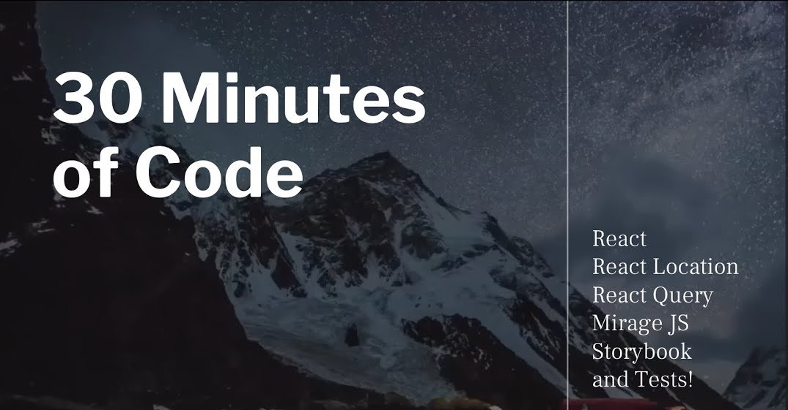

<h1 align="center">30 min of Code - S01</h1>

<p align="center">
  <a href="#dart-about">About</a> &#xa0; | &#xa0; 
  <a href="#rocket-technologies">Technologies</a> &#xa0; | &#xa0;
  <a href="#white_check_mark-requirements">Requirements</a> &#xa0; | &#xa0;
  <a href="#checkered_flag-starting">Starting</a> &#xa0; 
</p>

<br>

## :dart: About

Project development in Fabio Vedovelli Youtube Channel Playlist



## :rocket: Technologies

The following tools were used in this project:

- [Node.js](https://nodejs.org/en/)
- [React](https://pt-br.reactjs.org/)
- [React Location](https://react-location.tanstack.com/)
- [React Query](https://react-query.tanstack.com/)
- [Mirage JS](https://miragejs.com/)
- [Storybook](https://storybook.js.org/)
- [Jest](https://jestjs.io/)
- [Testing Library](https://testing-library.com/)

## :white_check_mark: Requirements

Before starting :checkered_flag:, you need to have [Git](https://git-scm.com) and [Node](https://nodejs.org/en/) installed.

## :checkered_flag: Starting

```bash
# Clone this project
$ git clone https://github.com/davi1985/30-min-of-code-s01

# Access
$ cd 30-min-of-code-s01

# Install dependencies
$ yarn

# Run the project
$ yarn start

# The server will initialize in the <http://localhost:3000>

# Run Storybook
$ yarn storybook

# The server will initialize in the <http://localhost:6006>
```

<a href="#top">Back to top</a>
